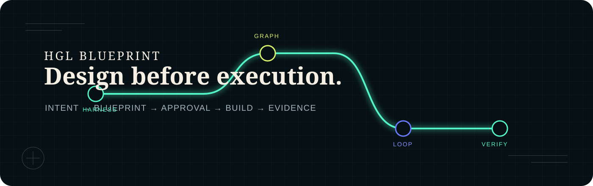

<div align="center">
  
</div>

<p align="center">
  <a href="README.md">English</a> ·
  <a href="README.zh-CN.md">简体中文</a> ·
  <a href="README.ja.md">日本語</a> ·
  <a href="README.ko.md">한국어</a>
</p>

<p align="center">
  <strong>Design the system before the system runs.</strong><br>
  A specification-first Skill for generating bounded, reviewable Harness–Graph–Loop systems.
</p>

## Why HGL Blueprint

Agent workflows often jump from an idea straight into execution. Scope, permissions, return contracts, and verification are decided implicitly while the system is already acting.

HGL Blueprint inserts a load-bearing boundary:

```text
intent → Blueprint → validate → human approval → build → verify → handoff
```

The project does not sell “more agents” as the answer. It chooses the smallest justified shape:

- a direct workflow for one bounded pass;
- a Loop when feedback can improve the next attempt;
- a Graph when bounded units have real dependencies or independent review;
- a Harness when tools, permissions, context, state, budgets, recovery, and auditability matter.

## What v1 generates

From one approved, provider-neutral `blueprint.json`:

- **Codex target** — generated project instructions and an operator Skill;
- **Python target** — dependency-free reference runtime and manifest;
- **Docs target** — human-readable architecture and acceptance contract.

Other adapters are intentionally not advertised until they have implementation and contract tests.

## Quick start

Invoke the installed Skill:

```text
Use $harness-graph-loop-builder to design a reviewable HGL Blueprint for
repairing one reproducible repository defect. Do not build until I approve.
```

Or validate the included example:

```bash
python3 skill/harness-graph-loop-builder/scripts/validate_blueprint.py \
  examples/code-repair/blueprint.json
```

Build is fail-closed: the example cannot generate a system while approval is pending.

## The contract

```text
HARNESS  tools · permissions · context · budgets · state · evidence
└── GRAPH  typed nodes · dependencies · routing · independent review
    └── LOOP  gather · act · verify · repair · persist · stop
```

Every Node returns a size-bounded Result Envelope, not its transcript. Every blocking acceptance criterion names a Verifier and an Evidence Record. Repository creation, commit, push, deployment, publication, and other external effects remain approval-gated.

## Verify the repository

```bash
python3 scripts/verify_repo.py
```

This checks the Skill structure, example Blueprint, graph invariants, approval gate, generated targets, and four-language key parity.

## Provenance

HGL Blueprint is an independent project inspired by [Archive228/loop-graph-harness](https://github.com/Archive228/loop-graph-harness), a compact teaching demonstration of Loop, Graph, and Harness composition. See [NOTICE](NOTICE) for the boundary and attribution.

## Status

Version 1 foundation: installable Skill, contract validators, approval-gated
generator, tested reference targets, and a multilingual project site.

MIT License.
